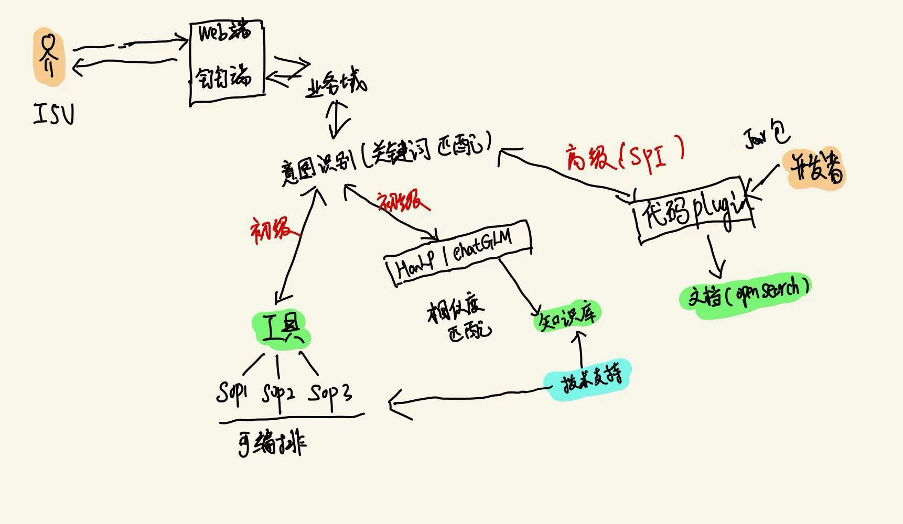

## 网关技术架构

 <div style="text-align: center;">  
      
</div>


业务网关：电商为主，对其他业务也通用

商业模式：商家 <=> ISV <=> 开放平台（网关+数据推送+电商云） <=> 交易中台

技术模型：服务市场（ERP软件售卖给商家） + 开放平台控制台（ISV+应用+SDK+API文档）+ 电商云 + API内部开放

## 核心指标

#### 网关核心指标

​	性能指标：RT 、吞吐量QPS
​	稳定性指标：SLA可用性4个9
​	业务指标：API的成功率

ISV核心指标：

​    应用开发和迭代效率 和 稳定性

## 核心技术点

#### 核心功能

授权、权限认证、限流、路由、参数转化

南北向+业务网关

#### Jetty有哪些比较好的设计？

Jetty（connector、线程池、Handler三部分）

I/O模型（NIO）、池化技术、减少系统调用、零拷贝、高效的并发编程模型（用原子变量和CAS取代锁、ConcurrentLinkedQueue无锁化队列）

**问题：为什么是servelet，不采用netty？**

#### 异步化具体是如何做的？

异步化：HSF异步化callback/Jetty serverlet异步

#### 高性能缓存是如何做的？

多层元数据缓存：bloomfiter/ 本地缓存/分布式缓存

缓存穿透解决：采用bloom filter 或 缓存<K,NULL>可以解决，本处采用bloom filter ，猜测大概率是因为如何设置为null值的话，内存无限制增长。

本地缓存：采用LRU缓存

分布式缓存：tair中间件（类似redis）

#### 流控是如何做的？

算法维度：令牌桶算法（可以应对突发流量） / 漏桶算法（输出流量比较均匀）

机器维度：单机流控（高流量API，减少对redis缓存的调用）/集群流控（低流量API）

业务维度：API/Appkey/API-Appkey/天维度/秒维度

#### 元数据缓存预热

  所谓服务预热,就是在服务启动完成到对外提供服务之前,针对特定场景提供一些初始化准备操作,比如线程池预热、缓存预热、数据库预热、web预热和jvm预热等等

#### 隐私安全是如何做的？

安全：收货地址、手机号、姓名等进行加密、解密。加解密的技术细节是怎样的？

#### 去中心化是如何做的？

为什么要做去中心化？以及是如何做的？

#### 压测是怎么做的？

1. 带压测标
2. 数据mock
3. 压测环境改造
4. 影子表、缓存和MQ等
5. 压测复盘

#### 常见的排查指标以及排查思路

|              | 指标维度                           |
| ------------ | ---------------------------------- |
| 业务接口     | 接口QPS、RT（TP99）                |
| Flink        | 反压、数据倾斜情况                 |
| 缓存         | 本地缓存、分布式缓存、缓存不一致   |
| 消息队列     | 数据消费进度                       |
| 数据库       | 并发事务、慢SQL                    |
| JVM          | GC情况/Jstack/线程池负载           |
| 操作系统     | 文件缓存、网络连接数、文件句柄数量 |
| 硬件         | CPU占用率/磁盘/网络情况            |
| 业务日志定位 | SLS日志                            |
| 全链路排查   | traceId，每个trace的调用情况       |
| 代码排查     | Arthas排查                         |

CPU利用率不高，线程数增大，GC频率无明显变化，RT变高，大概率是依赖的服务超时或者死锁

CPU利用率变高，线程数增大，GC频率明显变快，分析Jmap，有可能会有内存泄漏


<u>*引出：GC的相关知识点和线上排查日志的相关知识点*</u>

JVM GC常见的报错以及解决方案：

**Promotion Failure**：Old区没有足够的空间来分配年轻代晋升的对象。

**Concurrent Mode Failure**：Old区没有足够的空间来分配新的对象，此时垃圾回收器会退化成 serilaze 


## 数据中心

**作用**：用于API审计、监控告警、API治理

**流程**：集群异步写日志到本地磁盘->logtail->SLS->Flink SQL->hologress   

API维度、应用维度、商家维度、API-应用维度、分钟级、天级


**技术侧**：FlinkSQL技术栈==> *<u>引出实时计算知识点和数仓的相关技术</u>*

简单的Flink SQL的原理以及常见的业务优化技术

**业务侧**：原始操作日志-->中间进行小范围聚合，产生中间表 -> 面向上层服务可用的数据

ODS（操作层） -> DWM（中间层）-->DWS（服务层），与传统的数仓少一个去重、过滤空值这一层


## API工作台

API DevOps平台、API文档生成、API文档搜索（OpenSearch）

版本管理、API发布（自动化测试、灰度发布等功能）、监控告警、快速回滚等功能

#### 基于注解的二方包快速生成API

#### 基于HSF元数据快速生成API

#### 基于SmartEngine的工作流驱动API发布


<u>引出Spring 工厂模式、IOC和注解扫描+反射+代理</u>


## 智能答疑

从0到1搭建答疑体系，采用HanLP技术

 <div style="text-align: center;">  
      
</div>


引出插件化思想和概念，SPI & 流程可编排


## SDK技术

客户端调用示例代码（JAVA语言举例）：

```java
TaobaoClient client = new DefaultTaobaoClient(url, appkey, secret);
TradeFullinfoGetRequest req = new TradeFullinfoGetRequest();
req.setFields("tid,type,status,payment,orders,promotion_details");
req.setTid(123456789L);
req.setIncludeOaid("include_oaid");
TradeFullinfoGetResponse rsp = client.execute(req, sessionKey);
System.out.println(rsp.getBody());
```

GO语言、Java语言、Python语言、Net语言、C++语言等

基础包：HTTP调用、参数拼接、签名计算、返回结果反序列化

#### 验签的过程是怎样的？

#### 个性包文件是如何生成的？

个性化包：DSL+模版引擎=> 代码生成


http连接是长连接还是短连接？ 回答：短连接。同时如果是长连接，需要客户端和服务端（Ngnix到后端服务器）也支持这种特性，目前是不支持这种特性的。


#### 其他特性

多机房容灾

重试机制


引出kafka SDK和开放平台SDK的相似和不同之处：

kafka SDK核心解决消息的收发问题，本质上它屏蔽了网络层的一些通信细节

开放平台SDK核心解决：网关HTTP协议的拼接和验签过程，同时通过反序列化可以让开发者拿来即用数据结构。


## 授权技术

OAuth2 

服务端授权：code换token


## 与其他框架对比


### Zuul2.0


### 与开源框架Spring Cloud Gateway的对比

|            | TOP                   | Spring Cloud Gateway               |
| ---------- | --------------------- | ---------------------------------- |
| 业务       | 电商属性              | 一般通用                           |
| 企业规模   | 大型                  | 中小型                             |
| 技术生态   | HSF/Diamond/Sentiel   | Eruka/foregin/robin/configure等    |
| 路由配置   | 有单独的API配置中心   | 硬编码或yaml配置                   |
| 技术框架   | Jetty+HSF             | Netty+Reactor webflux异步框架      |
| 异步化方式 | Servelet 异步/HSF异步 | Reactor mnno框架/Netty事件驱动异步 |
|            |                       |                                    |
|            |                       |                                    |


小问题：Spring Cloud的微服务之间为什么是http调用，而不是rpc调用？

Spring Cloud核心组件原理解析，补充一下。

foregin的源代码解析。


Spring Could Config 对标 Diamond

Spring Could Gateway 对标 API网关

Spring Eruka 对标 HSF 注册中心

Hydrix对标 Sentiel


### 与Ngnix/OpenResty的对比

Ngnix流量网关和 业务网关


API网关负责将http请求路由到后端服务中，涉及鉴权、路由等

Ngnix更多的是http请求的反向代理。

Ngnix一般可以作为业务API网关的上游。


### 与开源框架Kong的对比

Kong是流量网关


### 与Service Mesh的对比

中心化网关===> 去中心化网关===> mesh化网关架构

一个是横向（东西，微服务之间的）的流量、一个是纵向（南北）的流量

Service mesh 解决什么问题？解决微服务化后，各个应用之间的服务通信和治理问题。

什么是Side Car？解决什么问题？它本质上是一种设计模式，它允许应用程序依赖的组件以容器化或者独立进程的方式部署。


