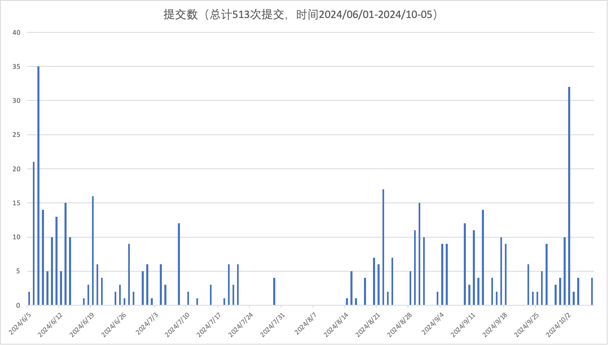

# 大数据+AI+后端技术笔记

## 算法
[leetcode](https://github.com/yyb345/interview_notes/tree/master/leetcode) | [编程之美](https://github.com/yyb345/notes/tree/master/documents) 

## AI技术

[利用LangChain+大模型落地一个应用场景](https://github.com/yyb345/notes/blob/master/AI/langchain.md)

 [李飞飞20240924采访](https://github.com/yyb345/notes/blob/master/AI/feifei_interview.md)

## 大数据技术

kafka、flink、spark

 [消息队列对比（Kafka、RocketMq、Pulsar）](https://github.com/yyb345/notes/blob/master/bigdata/kafka/mq.md)

 [Flink技术原理](https://github.com/yyb345/notes/blob/master/bigdata/flink/flink_main.md)

### 后端技术

Java、Redis 、RPC技术、Spring Cloud、API网关等技术

[API网关核心技术](https://github.com/yyb345/notes/blob/master/Backend/openplatform/apigateway.md)

[美团网关技术演进](https://tech.meituan.com/2021/05/20/shepherd-api-gateway.html)

[美团SDK自动化生成实践](https://tech.meituan.com/2023/01/05/openplatform-sdk-auto-generate.html)

 

​       
