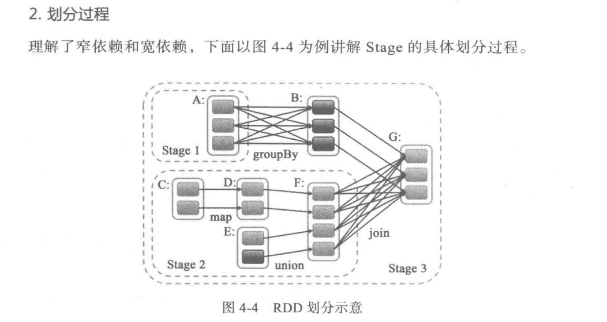

# 好记性不如烂笔头！

## 0. 算法学习
[leetcode](https://github.com/yyb345/notes/tree/master/code/src/leetcode) 

[编程之美](https://github.com/yyb345/notes/tree/master/documents)  
[牛客网]()  

## 1.JVM学习
### JAVA语言基础
 [Java 泛型解析](https://www.zhihu.com/question/20400700)   

### JAVA常用的集合
 [Java 集合类解析](https://www.cnblogs.com/yueshutong/p/9696216.html)   

### JAVA 多线程
 [Java 并发编程](https://www.cnblogs.com/wxd0108/p/5479442.html)    
 [Java 锁解析](https://tech.meituan.com/2018/11/15/java-lock.html)   
 [不得不说的java“锁”事](https://tech.meituan.com/2018/11/15/java-lock.html)  

### JAVA I/O
[BIO NIO AIO总结](https://github.com/Snailclimb/JavaGuide/blob/master/docs/java/BIO-NIO-AIO.md)  

### 类加载机制
  [Java 类加载机制](https://juejin.im/post/5a810b0e5188257a5c606a85)  
  [Java Agent 解析](https://www.javazhiyin.com/27630.html)   
  [Java agent源码解析](https://www.infoq.cn/article/javaagent-illustrated)  
### 运行时数据区域
 [Java  对象解析](https://blog.csdn.net/smileiam/article/details/80364641)  
 [Java JVM内存调优](https://zhanjindong.com/2016/03/02/jvm-memory-tunning-notes)  
 [JVM 内存模型](https://juejin.im/post/5ad5c0216fb9a028e014fb63)   
 [JVM内存划分、JVM内存分配机制、JVM垃圾回收机制](https://blog.csdn.net/CSDN_Terence/article/details/77771429)  

### 进程间通信  

[进程间通信](java/进程间通信.md)

  

## 2. 分布式

   [Zookeeper选举分析](https://www.cnblogs.com/longxok/p/8951867.html)   
   [分布式锁 ](https://juejin.im/post/5bbb0d8df265da0abd3533a5)   
   [Chandy-Lamport解析](https://yq.aliyun.com/articles/688764)  
   [分布式事务]()  
     
        

## 3. Kafka
### 先验知识
* [操作系统PageCache](https://www.ibm.com/developerworks/cn/linux/l-cache/index.html)
* JAVA NIO
* [mmap知识点](https://www.cnblogs.com/huxiao-tee/p/4660352.html)
* 分布式Leader选举机制
* CAP

   
### Kafka 设计理念
  [Kafka 历史发展解析](https://www.infoq.cn/article/MLMyoWNxqs*MzQX7lvzO)  
  [Kafka 高性能解析](http://www.jasongj.com/kafka/high_throughput/)  
  [Kafka 高可用解析](https://www.infoq.cn/article/kafka-analysis-part-3)  
  [Kafka Leader PacificA解析](http://www.thinkingyu.com/articles/PacificA/)  
  [Kafka 机房容灾解析](https://mp.weixin.qq.com/s?__biz=MzU1NDA4NjU2MA==&mid=2247494329&idx=3&sn=68253c54f0e034c465a7517bb1c7605e&chksm=fbea5376cc9dda607632db6441d742f92e3c5e1ed123587a6a02c0ff593e9d647cd6ff042aa5&scene=27#wechat_redirect)  
  [Kafka 语义处理层解析](https://hevodata.com/blog/kafka-exactly-once/)  
  [Kafka 顺序性保障解析](https://medium.com/@felipedutratine/kafka-ordering-guarantees-99320db8f87f)  
  [Kafka技术分享系列 ](http://blog.csdn.net/lizhitao/article/details/39499283)  
### Kafka源码解析
  [Kafka 存储层解析](https://tech.meituan.com/2015/01/13/kafka-fs-design-theory.html)  
  [Kafka Network层解析 ](https://juejin.im/post/5c19c787f265da613c09be5c)  
  [Kafka Admin层解析](http://matt33.com/2017/07/21/kafka-topic-create/)  
  [Kafka Consumer解析](http://zqhxuyuan.github.io/2016/01/19/2016-01-19-Kafka-Consumer-scala/#ZookeeperConsumerConnector)  
  [Kafka 性能调优解析](https://community.hortonworks.com/questions/73895/any-experience-based-tips-to-optimize-kafka-broker.html)  
  [为什么Kafka那么快](https://manbuyun.github.io/2017/01/13/%E4%B8%BA%E4%BB%80%E4%B9%88Kafka%E9%82%A3%E4%B9%88%E5%BF%AB/)  
  [Kafka Exactly Once Delivery and Transactional Messaging ](https://cwiki.apache.org/confluence/display/KAFKA/KIP-98+-+Exactly+Once+Delivery+and+Transactional+Messaging#KIP-98-ExactlyOnceDeliveryandTransactionalMessaging-DataFlow)  
### Kafka bugs
  [\[原创\]Kafka Controller脑裂问题](https://zhuanlan.zhihu.com/p/75524641)       

### pulsar VS kafka
[bookeeper原理浅析](http://matt33.com/2019/01/28/bk-store-realize/#一致性模型)  

## 4. 开放平台技术   

1. [开放平台网关](https://tech.meituan.com/2021/05/20/shepherd-api-gateway.html)

2. [Oauth授权](https://www.cnblogs.com/CKExp/p/15938916.html)

3. [RPC技术](https://github.com/yyb345/notes/tree/master/rpc-spring-starter-main)

4. Jetty/Tomcat技术

     Jetty（connector、线程池、Handler三部分）

     I/O模型（NIO）、池化技术、减少系统调用、零拷贝、高效的并发编程模型（用原子变量和CAS取代锁、ConcurrentLinkedQueue无锁化队列）

5. API DevOps技术

6. API SDK 生成技术

7. Spring Cloud技术

      Spring Cloud GateWay 比较 

​     

##        

## 5. 大数据计算框架

### 流式处理框架  
  [DataFlow编程模型](https://www.jianshu.com/p/0faa1c1caa47)  
  [Flink Spark对比](https://www.infoq.cn/article/spark-vs-flink)  
  [Flink Storm对比](https://tech.meituan.com/2017/11/17/flink-benchmark.html)  
  [如何使用Spark Streaming + Kafka如何实现精确一次语义?](https://www.zhihu.com/question/334249637/answer/744493120)  

### Flink Example 
  [Flink Training](https://training.ververica.com/)   
  [Flink如何让每一条数据进来后延迟一段时间再被处理?](https://www.zhihu.com/question/332577514/answer/840181621)   

### Flink 原理解析 
  [Flink Runtime核心机制解析](https://www.infoq.cn/article/RWTM9o0SHHV3Xr8o8giT)    
  [Flink Window 机制解析](http://wuchong.me/blog/2016/05/25/flink-internals-window-mechanism/#comments)  
  [Flink Watermark 解析](https://blog.csdn.net/lmalds/article/details/52704170)  
  [Flink 反压解析 ](http://wuchong.me/blog/2016/04/26/flink-internals-how-to-handle-backpressure/)  
  [Flink 内存管理解析](http://wuchong.me/blog/2016/04/29/flink-internals-memory-manage/)  
  [Flink 分布式快照解析](http://xargin.com/distributed-snapshot-in-stream-sys/)  
  [Flink checkpoint与savepoint的区别](https://www.whitewood.me/2018/09/06/Flink-Checkpoint-Savepoint-%E5%B7%AE%E5%BC%82/)  
  [Flink failover机制解析--待翻译](https://cwiki.apache.org/confluence/display/FLINK/FLIP-1+%3A+Fine+Grained+Recovery+from+Task+Failures)  
  [\[原创\]Flink TTL state解析](https://github.com/yyb345/index/blob/master/flink/ttl_state.md)  

  [Flink-分布式快照的设计](http://chenyuzhao.me/2018/01/29/Flink-%E5%88%86%E5%B8%83%E5%BC%8F%E5%BF%AB%E7%85%A7%E7%9A%84%E8%AE%BE%E8%AE%A1-%E6%B5%81%E7%A8%8B/)  

  [Flink  Kafka 0.11 exactly once](https://www.cnblogs.com/huxi2b/p/8459342.html)  
  [Flink Exactly-Once 解析](http://www.whitewood.me/2018/10/16/Flink-Exactly-Once-%E6%8A%95%E9%80%92%E5%AE%9E%E7%8E%B0%E6%B5%85%E6%9E%90/)  
  [Flink State 使用文档](https://ci.apache.org/projects/flink/flink-docs-master/dev/stream/state/state.html)  
   [Memory Management and Configuration Reloaded - Google 文档](https://docs.google.com/document/d/1o4KvyyXsQMGUastfPin3ZWeUXWsJgoL7piqp1fFYJvA/edit#heading=h.ie6fcly7mrci)  
   [Memory Management (Batch API) ](https://cwiki.apache.org/confluence/pages/viewpage.action?pageId=53741525)  
  [FLIP-50: Spill-able Heap Keyed State Backend](https://cwiki.apache.org/confluence/display/FLINK/FLIP-50%3A+Spill-able+Heap+Keyed+State+Backend)  
### Flink bugs
[\[原创\]Flink 1.7.1 版本问题记录](https://zhuanlan.zhihu.com/p/80236965)     
[\[FLINK-13477\] Add memory-overhead-ratio conf for containers by BenoitHanotte · Pull Request #9265 · apache/flink](https://github.com/apache/flink/pull/9265)  

​    

### Spark原理解析

#### 编程模型

  常见的算子 Map FlatMap Union GroupBy ReduceBy 

  常见的数据结构: DStream

   RDD==RDD的核心数据结构？

   宽窄依赖== 如何识别和优化的？

#### RUNTIME模型

​     DAG 以及 DAG中的Stage是如何划分的？（窄依赖划分一个stage、宽依赖划分一个stage）

​    shuffle是怎么做的？== Hash Shuffle 和 Sort Shuffle

#### CheckPoint

#### Spark SQL

#### Spark Streaming 

  

有哪些比较好的设计和优化？

常见的业务问题和热点问题   

 [常见面试题](https://www.cnblogs.com/crazymakercircle/p/17539112.html#autoid-h2-5-0-0 )     

## 6. 数据仓库

大数据技术哪家强？ https://mp.weixin.qq.com/s/6MXcmk9158iiqe0jXKJqBQ

数据仓库是如何分层的？

  	ODS 操作层数据
  	
  	DWD(detail) 细节层【去重、去空等】
  	
  	DWM(Middle) 中间层

​	 DWS(Server)  服务层

​     维表，各种维度的表

Hive的驱动层是如何做的？如何翻译为MR或者Spark SQL任务的？ 
Hive有索引优化么？
        

## 7. Hbase

 [HBase列式存储](https://www.zhihu.com/question/29380943)  
 [HBase深入浅出](https://juejin.im/post/5c666cc4f265da2da53eb714#heading-2)  
  [HBase查询性能优化](https://www.ibm.com/developerworks/cn/java/j-lo-HBase/index.html)  
  [HBase的rowkey的设计](https://www.cnblogs.com/yuguoshuo/p/6265649.html)  
  hbase 与mysql的区别？ 

  

## 8. 资源调度

* 资源隔离的基础: Cgroups基础
* 资源管理的基本原理: CPU 内存隔离
* 资源管理的关键技术:
* 资源管理的几种实现:

Yarn与K8s有什么区别，Flink 部署在这两个环境中有什么区别？

​      

## 9. Machine Learning

  [深度学习500问](https://github.com/scutan90/DeepLearning-500-questions)  

## 10. 常用工具

  [guava](https://github.com/google/guava/wiki)   
  [mac IDEA快捷键](https://wiki.jikexueyuan.com/project/intellij-idea-tutorial/keymap-mac-introduce.html)   
  [maven 学习笔记](https://juejin.im/post/5af8336851882542a966bd07#heading-0)  

## 11 .  性能诊断
[快速分析性能瓶颈](https://www.infoq.cn/article/iSTZ0XT4vyM6XXTx1Fx1)  
[SLA](https://darrykinger.com/index.php/archives/59/)  

 

​       
