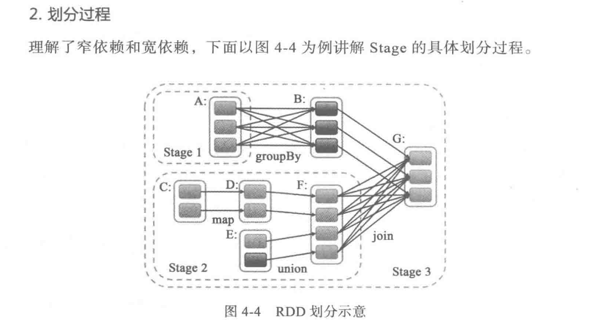

## 1.大数据组件

Lamda架构：离线计算和在线计算相融合

1. 消息队列Kafka

2. 计算框架：Spark、Flink

3. 资源管理框架：Yarn、K8s、Mesos

4. 存储框架：Hdfs（GFS的开源实现）、Hbase（BigTable的开源实现）

5. 查询框架：Hive、Spark Sql、Presto、Druid、Kylin

6. 分布式管理框架：Zookeeper

7. Hadoop生态

## 2. Kafka

### 先验知识

* [操作系统PageCache](https://www.ibm.com/developerworks/cn/linux/l-cache/index.html)
* JAVA NIO
* [mmap知识点](https://www.cnblogs.com/huxiao-tee/p/4660352.html)
* 分布式Leader选举机制
* CAP 

### Kafka 设计理念

  [Kafka 历史发展解析](https://www.infoq.cn/article/MLMyoWNxqs*MzQX7lvzO)  
  [Kafka 高性能解析](http://www.jasongj.com/kafka/high_throughput/)  
  [Kafka 高可用解析](https://www.infoq.cn/article/kafka-analysis-part-3)  
  [Kafka Leader PacificA解析](http://www.thinkingyu.com/articles/PacificA/)  
  [Kafka 机房容灾解析](https://mp.weixin.qq.com/s?__biz=MzU1NDA4NjU2MA==&mid=2247494329&idx=3&sn=68253c54f0e034c465a7517bb1c7605e&chksm=fbea5376cc9dda607632db6441d742f92e3c5e1ed123587a6a02c0ff593e9d647cd6ff042aa5&scene=27#wechat_redirect)  
  [Kafka 语义处理层解析](https://hevodata.com/blog/kafka-exactly-once/)  
  [Kafka 顺序性保障解析](https://medium.com/@felipedutratine/kafka-ordering-guarantees-99320db8f87f)  
  [Kafka技术分享系列 ](http://blog.csdn.net/lizhitao/article/details/39499283)  

### Kafka源码解析

  [Kafka 存储层解析](https://tech.meituan.com/2015/01/13/kafka-fs-design-theory.html)  
  [Kafka Network层解析 ](https://juejin.im/post/5c19c787f265da613c09be5c)  
  [Kafka Admin层解析](http://matt33.com/2017/07/21/kafka-topic-create/)  
  [Kafka Consumer解析](http://zqhxuyuan.github.io/2016/01/19/2016-01-19-Kafka-Consumer-scala/#ZookeeperConsumerConnector)  
  [Kafka 性能调优解析](https://community.hortonworks.com/questions/73895/any-experience-based-tips-to-optimize-kafka-broker.html)  
  [为什么Kafka那么快](https://manbuyun.github.io/2017/01/13/%E4%B8%BA%E4%BB%80%E4%B9%88Kafka%E9%82%A3%E4%B9%88%E5%BF%AB/)  
  [Kafka Exactly Once Delivery and Transactional Messaging ](https://cwiki.apache.org/confluence/display/KAFKA/KIP-98+-+Exactly+Once+Delivery+and+Transactional+Messaging#KIP-98-ExactlyOnceDeliveryandTransactionalMessaging-DataFlow)  

### Kafka bugs

Kafka Controller脑裂问题](https://zhuanlan.zhihu.com/p/75524641)       

### pulsar VS kafka

[bookeeper原理浅析](http://matt33.com/2019/01/28/bk-store-realize/#一致性模型)  

## Flink 原理

### Flink bugs

[\[原创\]Flink 1.7.1 版本问题记录](https://zhuanlan.zhihu.com/p/80236965)     
[\[FLINK-13477\] Add memory-overhead-ratio conf for containers by BenoitHanotte · Pull Request #9265 · apache/flink](https://github.com/apache/flink/pull/9265)  

​    

## Spark原理

#### 编程模型

  常见的算子 Map FlatMap Union GroupBy ReduceBy 

  常见的数据结构: DStream

   RDD==RDD的核心数据结构？

   宽窄依赖== 如何识别和优化的？

#### RUNTIME模型

​     DAG 以及 DAG中的Stage是如何划分的？（窄依赖划分一个stage、宽依赖划分一个stage）

​    shuffle是怎么做的？== Hash Shuffle 和 Sort Shuffle

#### CheckPoint

#### Spark SQL

#### Spark Streaming 

  

有哪些比较好的设计和优化？

常见的业务问题和热点问题   

 [常见面试题](https://www.cnblogs.com/crazymakercircle/p/17539112.html#autoid-h2-5-0-0 )     

## 6. 数据仓库

大数据技术哪家强？ https://mp.weixin.qq.com/s/6MXcmk9158iiqe0jXKJqBQ

数据仓库是如何分层的？

  	ODS 操作层数据
  	DWD(detail) 细节层【去重、去空等】
  	DWM(Middle) 中间层
  	DWS(Server)  服务层

​	

Presto架构

​     维表，各种维度的表

Hive的驱动层是如何做的？如何翻译为MR或者Spark SQL任务的？ 
Hive有索引优化么？
        

## 7. Hbase

NO-SQL

Hbase的本质：**sparse, distributed, persistent multidimensionalsorted map**

HBase中Map的key是一个复合键，由rowkey、column family、qualif ier、type以及timestamp组成

 Hbase的应用场景：时序数据库-例如openTSDB，用户画像特征标签、某个人的朋友圈、Kylin等存储

一般情况下可以将Hive离线计算出来的用户特征标签导入到Hbase中，以方便进行在线查询和实时服务。

Master、RegionServer、Zookeeper

LSM树+跳表

为了满足大数据领域写的高性能要求，采用批量写+LSM树（分层次merge聚合的方式）

文件：HFile

[HBase列式存储](https://www.zhihu.com/question/29380943)  
 [HBase深入浅出](https://juejin.im/post/5c666cc4f265da2da53eb714#heading-2)  
  [HBase查询性能优化](https://www.ibm.com/developerworks/cn/java/j-lo-HBase/index.html)  
  [HBase的rowkey的设计](https://www.cnblogs.com/yuguoshuo/p/6265649.html)  
  hbase 与mysql的区别？ 

一个是NO-SQL，不支持事务；一个是关系型数据库

  

## 8. 资源调度Yarn和K8s

* 资源隔离的基础: Cgroups基础
* 资源管理的基本原理: CPU 内存隔离
* 资源管理的关键技术:
* 资源管理的几种实现:

Yarn与K8s有什么区别，Flink 部署在这两个环境中有什么区别？
