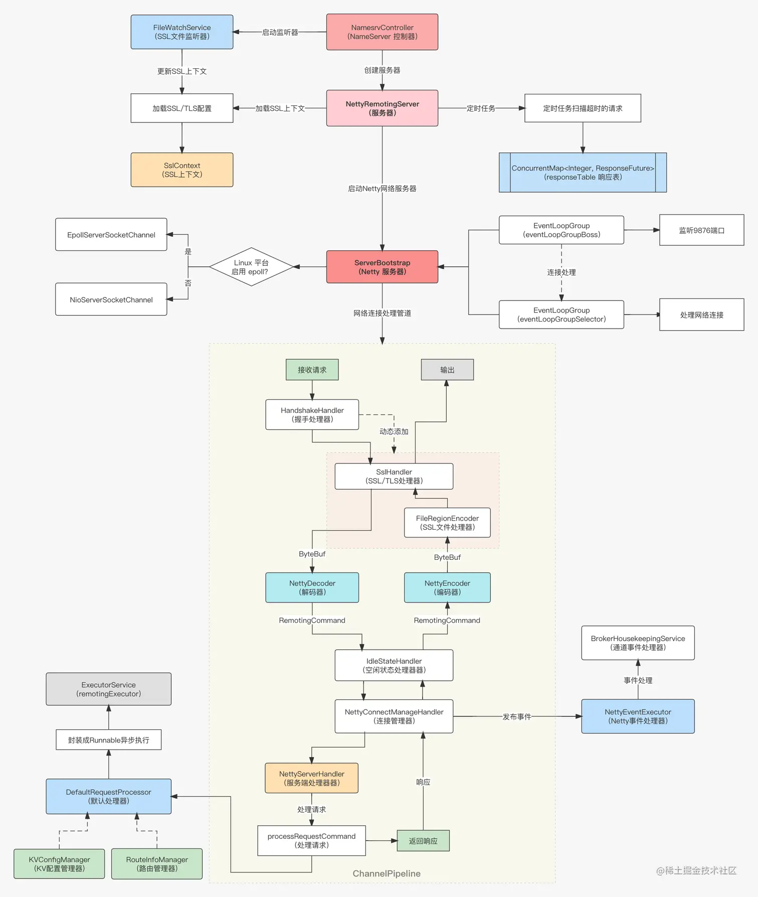
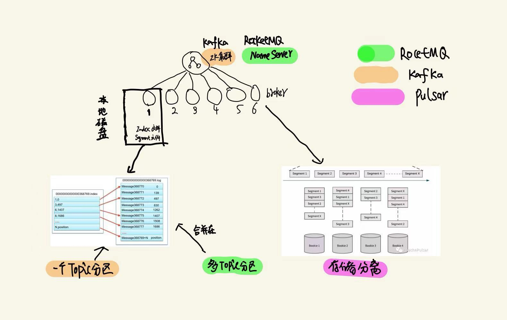

# 常见消息队列kafka rocketmq pulsar对比

## 部署架构

kafka：zookeeper集群、broker集群

RocketMq：NameServer集群、broker集群

Pulsar：bookeeper集群（日志存储系统）、broker集群 ，典型地计算与存储分离的架构。

## 元数据存储

kafka：2.8版本以前是在zookeeper上存储 2.8版本之后，抛弃zookeeper，采用类似RAFT协议，主要考虑到当集群节点比较多，topic数量比较多时，zookeeper就会成为系统瓶颈。

```java
/brokers
	/broker/ids/   所有的broker节点，每个broker的配置文件中都需要指定一个数字类型的id
	/broker/topics/  所有的topic注册信息；
	/brokers/topics/[topic_name]/partitions/ 某个topic的partitions所有分配信息；

/controller
	/controller_epoch Controller的选举次数（默认从1开始）

/consumers
	/consumers/[group_id]/ids/ Consumer订阅信息，每个consumer都有一个唯一的ID用来标记消费者信息；
	/consumers/[group_id]/owners/[topic_name]/[partition_id]  consumer group对应的各个topic及partition的消费者线程。
	/consumers/[group_id]/offsets/[topic_name]/[partition_id] consumer group对应的各个topic及partition的消费偏移量。

/admin
	/admin/reassign_partitions  partition重分配信息；
	/admin/preferred_replica_election 最优replica选举信息；
	/admin/delete_topics  近期删除的topic；
/isr_change_notification/  ISR变更通知信息；
                 
```


Rocketmq：存储在nameserver上


## 网络层

### 通信协议

  kafka：

 通用的通信协议格式：

```scala
RequestMessage => ApiKey ApiVersion CorrelationId ClientId RequestMessage
  ApiKey => int16
  ApiVersion => int16
  CorrelationId => int32
  ClientId => string
  RequestMessage => MetadataRequest | ProduceRequest | FetchRequest | OffsetRequest | OffsetCommitRequest | OffsetFetchReques
```

  rocketmq：

```scala
++++++++++++++++++++++++++++++++++++++++++++++++++++++++++++++++++++++++++
+ frame_size | header_length |         header_body        |     body     +
++++++++++++++++++++++++++++++++++++++++++++++++++++++++++++++++++++++++++
+   4bytes   |     4bytes    | (21 + r_len + e_len) bytes | remain bytes +
++++++++++++++++++++++++++++++++++++++++++++++++++++++++++++++++++++++++++
```

  pulsar：


### 通信框架

kafka：基于Java NIO开发的kafka network 客户端

rocketMq：基于Netty异步网络I/O通信框架开发，NettyRemotingClient和NettyRemotingServer

epoll和NIO的区别，NIO是select轮询，epoll是事件驱动。

pulsar：基于Netty异步网络I/O通信框架开发。




## 存储层


### 存储与计算是否分离？





### 存储格式

索引文件：Index文件，稀疏索引

日志文件：存储每条日志

kafka：每个topic，每个分区，在一个日志文件中。

rocketmq：多个topic的分区记录可以存储在一个日志文件中

pulsar：每个topic每个分区的数据单独存储在bookeeper中


## Producer层

异步发送、批量发送

## Consumer层

Kafka: partition级别并行，consumer group 的每个consumer至多消费一个partition

rocketMq: 消费模式基本跟kafka类似，但是它支持<u>消息广播</u>

pulsar：三种模式，独占模式、failover模式、共享模式，我们只讨论共享模式，consumer可任意扩展，不受partition分区数的限制。


**Rebalance**：consumer group数量有变化的时候，分区与cosumer的消费关系重新被分配。

**顺序消费**：

至少一次，exactly一次消费：

**回溯消费**：

**重试机制**：


## 消息功能特性

**消息轨迹查询**：kafka不支持、rocketmq支持

**延迟消息**：kafka不支持，rocketmq支持

  延迟级别：1s 5s 10s 30s 1m 2m 3m 4m 5m 6m 7m 8m 9m 10m 20m 30m 1h 2h

  原理：rocketmq支持不同级别的延迟消息，具体的实现策略是会有一个单独的topic ___xxx_topic 记录所有延迟topic的消息，这条消息会多一个属性，就是延迟的消息级别。然后会有一个定时任务消费这个topic去扫描，是否满足延迟条件，如果满足，则将这条消息发送到真正的topic上。

**事务消息**：

**消息Tag**：kafka不支持、rocketmq支持


## 高可用设计

### 集群的Controller管理


### 分区的副本管理

kafka ISR的概念 每个分区都有Leader，N个副本，副本是异步拉取消息进行数据同步的。

**ACK机制**：


## 高可靠性

**刷盘策略**：同步刷盘、异步刷盘

数据一致性

kafka：弱一致性：

pulsar：强一致性

## 高性能设计

PageCache：是操作系统的文件缓存机制。

Zero-Copy

顺序写磁盘

