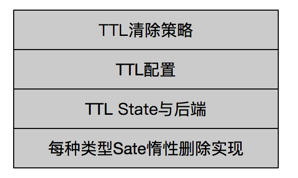

# Flink State TTL解析
[TOC]
##  TTL State简介
什么是State？为什么会有state？

   流式计算中

保存状态（包括计算状态）
举例子说明：

分为哪几种state？Flink API提供了以下几种类型的接口，都是keyedStream，也就是key之后的流

* ValueState
* ListState
* MapState
* ReducingState
* AggregatingState
* FoldingState

## StateBackend有哪些？
* 堆 也就是我们传统使用的java对象，数据保存在JVM内存中，有一个缺点是由于GC时间不确定，所以可能会对性能造成一定的影响
* RocksDb rocksdb提供了一个k v存储库，数据持久化在本地，在内存中是非堆内存形式存在的，因此，有可能会有内存泄漏的风险。


## TTL State源码分析
### 如何手动实现state定期删除？
Flink中用户state在某种场景下会持续增长，需要删除过期的state，而用户需要采用Flink的timerService手动去实现state的删除，如下

```java
public class StateTimerFunction extends KeyedProcessFunction<String,byte[],String> {

	private static final Logger logger = LoggerFactory.getLogger(StateTimerFunction.class);

	private ValueState<byte[]> sendCacheStorage;
	private static final Long TTL_MINUTE=5*60*1000L;
	@Override
	public void open(Configuration parameters) throws Exception {
		sendCacheStorage = getRuntimeContext().getState(new ValueStateDescriptor<byte[]>("sendCacheStorage", byte[].class));
	}

	@Override
	public void processElement(byte[] bytes, Context context, Collector<String> collector) throws Exception {

		try {
			//注册触发时间
			context.timerService().registerProcessingTimeTimer(System.currentTimeMillis() + TTL_MINUTE);
		} catch (Exception e) {
			logger.error(e.getMessage());
		}

	}

	@Override
	public void onTimer(long timestamp, OnTimerContext ctx, Collector<String> out) throws Exception {
	    // 定时会触发该操作
		sendCacheStorage.clear();
	}

}
```

### 设计思想
其实现思想也比较朴素，首先为每个Value加上时间戳，其次采用[惰性删除](https://baike.baidu.com/item/%E6%83%B0%E6%80%A7%E5%88%A0%E9%99%A4)的策略。caffine cache，rocksDB，redis过期删除都采取了这种策略。简单来讲，就是在下一次访问数据的时候，会判断数据是否过期，若过期，则删除，否则数据依然存在 

```java
    public class TtlValue<T> implements Serializable {
		// 为value加上时间戳
		private static final long serialVersionUID = 5221129704201125020L;
	
		@Nullable
		private final T userValue;
		private final long lastAccessTimestamp;
	
	
		public TtlValue(@Nullable T userValue, long lastAccessTimestamp) {
			this.userValue = userValue;
			this.lastAccessTimestamp = lastAccessTimestamp;
		}
	}

```
本文将从以下几个方面来介绍    




### TTL清除策略
* **访问清除策略**： 也即当用户访问state时，会判断当前state是否过期，若过期则删除，不会返回数据，一般访问之处会有get，迭代器访问等。
* **全量SNAPSHOT清理策略**：若开启checkpoint，定期保存的快照会删除过期数据，但是stateBackend并不会删除，只有等下一次作业重启，Flink会load保存的快照，而保存的快照并没有过期数据。
* **后台清除策略**： 增量清理策略（适用于堆内存的stateBackend，这种策略意味着每次state数据被访问或者处理时，都会触发清理策略）与RocksDB compaction（适用于rocksdb后端，rocksdb在后台会间歇性地进行异步压缩来减少存储的大小）

### TTL ListValueState 实现
* update实现
* get实现
* 迭代器实现也比较简单，hasNext()函数中会迭代寻找是否有下一个未过期的值，并删除过期的值，next()函数会迭代寻找下一个未过期的值
  
   ```java
  	private class IteratorWithCleanup implements Iterator<T> {
		private final Iterator<TtlValue<T>> originalIterator;
		private boolean anyUnexpired = false;
		private boolean uncleared = true;
		private T nextUnexpired = null;

		private IteratorWithCleanup(Iterator<TtlValue<T>> ttlIterator) {
			this.originalIterator = ttlIterator;
		}

		@Override
		public boolean hasNext() {
		// 寻找下一个未过期的
			findNextUnexpired();
			cleanupIfEmpty();
			return nextUnexpired != null;
		}

		private void cleanupIfEmpty() {
			boolean endOfIter = !originalIterator.hasNext() && nextUnexpired == null;
			if (uncleared && !anyUnexpired && endOfIter) {
				original.clear();
				uncleared = false;
			}
		}

		@Override
		public T next() {
			if (hasNext()) {
				T result = nextUnexpired;
				nextUnexpired = null;
				return result;
			}
			throw new NoSuchElementException();
		}

		private void findNextUnexpired() {
			while (nextUnexpired == null && originalIterator.hasNext()) {
				TtlValue<T> ttlValue = originalIterator.next();
				if (ttlValue == null) {
					break;
				}
				boolean unexpired = !expired(ttlValue);
				if (unexpired) {
					anyUnexpired = true;
				}
				if (unexpired || returnExpired) {
					nextUnexpired = ttlValue.getUserValue();
				}
			}
		}
	}
   ```
    

### TTL MapState 实现
* update实现
* get实现
* 迭代器实现

## TTL State 现有的不足之处

* 不支持一条数据过期后，有相应的触发操作，也即类似拦截器的作用
* 当一条数据不被访问时，该数据可能不会被删除 

## TTL State如何使用？
 TTL各个配置含义：
StateTtlConfig 配置详解

```java
StateTtlConfig ttlConfig = StateTtlConfig
    .newBuilder(Time.seconds(1))
    .setUpdateType(StateTtlConfig.UpdateType.OnCreateAndWrite)
    .setStateVisibility(StateTtlConfig.StateVisibility.NeverReturnExpired)
    .build();
    
ValueStateDescriptor<String> stateDescriptor = new ValueStateDescriptor<>("text state", String.class);
stateDescriptor.enableTimeToLive(ttlConfig);
```


