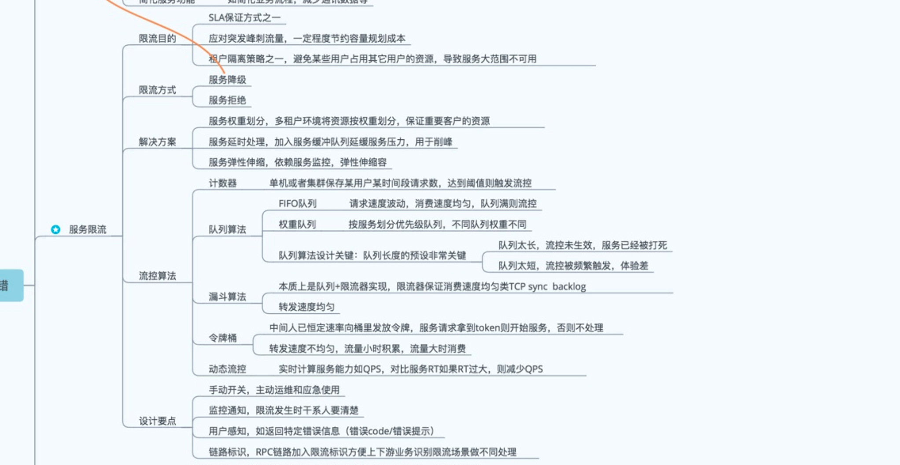

   * [Kafka 端到端源码解析](#kafka-端到端源码解析)
      * [Kafka的场景](#kafka的场景)
      * [Kafka概念](#kafka概念)
      * [Topic 创建与删除](#topic-创建与删除)
         * [Topic状态流转](#topic状态流转)
         * [一些问题](#topic-一些问题)
         * [Topic分区初始化选择](#topic分区初始化选择)
      * [kafka producer解析](#kafka-producer解析)
         * [1. 发送流程](#1-发送流程)
         * [2. 分区选择策略？](#2-分区选择策略)
         * [3. 拦截器有什么作用？](#3-拦截器有什么作用)
         * [4. 关键数据结构](#4-关键数据结构)
         * [5.  参数配置](#5--参数配置)
         * [6. ACK机制](#6-ack机制)
         * [7.一些问题](#7-producer一些问题)
      * [Kafka网络接收层](#kafka网络接收层)
         * [Kafka channel](#kafka-channel)
         * [如何做限流的](#如何做限流的)
      * [Kafka内存管理](#kafka内存管理)
         * [堆内存](#堆内存)
         * [堆外内存](#堆外内存)
      * [kafka 存储层解析](#kafka-存储层解析)
         * [消息格式](#消息格式)
         * [消息索引](#消息索引)
         * [一些问题](#一些问题)
      * [副本管理](#副本管理)
         * [failover机制](#failover机制)
      * [kafka Consumer解析](#kafka-consumer解析)
         * [0.8.2版本客户端](#082版本客户端)
         * [0.10版本客户端](#010版本客户端)
         * [一些问题](#一些问题-1)
      * [zookeeper的作用](#zookeeper的作用)
         * [zookeeper在kafka中的作用](#zookeeper在kafka中的作用)
           
# Kafka 端到端源码解析
 
##  Kafka的场景

## Kafka概念
* **Broker**
* **Topic**
* **Partition**   逻辑上最小的单元
* **Offset**
* **LogSegment**   文件存储最小的单元
* **Producer**   生产者
* **Consumer**   消费者
* **Zookeeper**  提供分布式协调服务
* **Controller**   集群中的master
* **ISR(In-Sync-Replica)**   Topic分区的副本状态
*  **脑裂** 集群中出现了双主，对于kafka来说是双controller
*  **羊群效应** 当zookeeper上一个znode节点发生变化时，所有监听该节点的客户端都会发生相应的动作

## Topic 创建与删除
   zk注册，controller选举具体的数据结构与流程
   
   
### Topic状态流转
   创建、在线、增加分区、下线、删除
   
###  Topic 一些问题
* topic分区数可不可以减少？如果可以，为什么？ 
   **不可以**
*   Kafka 目前有哪些内部topic？分别的作用是什么？ 
    **__consumer_offset** 用来保存用户groupId对应的消费topic offset
       

### Topic分区初始化选择

  按照broker数量均匀地分布在每个broker上

## Kafka Producer解析

### 1. 发送流程
* 第一步： 刷新元数据
* 第二步： 序列化、选择分区、注册拦截器回调函数
* 第三步： 往RecordAccmulator发送数据
* 第四步：判断batch是否满了，满了的话唤醒send后台线程  
  有可能的异常：API版本不匹配；Buffer耗尽等

### 2. 分区选择策略？
*  若该消息内无指定分区，则使用消息中指定的key哈希生成的分区
*  若key为null，则按照轮询的方式生成分区
*  最后一种，若仍然不满足需求，用户还可以自己指定partition分区策略类，每条消息都按照这个策略进行   
    因此，分区策略可以有四个级别：用户自定义分区策略类、key哈希、轮询、任一消息选择任一分区，总的来说给用户很大的自由度。

### 3. 拦截器有什么作用？
在每次消息处理成功后增加一个回调函数，一般用来记录一些统计信息，为每条消息增加其他字段等等。

### 4. 关键数据结构
RecordAccmulator的内部是如何运作的？

《TopicPartition，Batch队列》这是重要的数据结构

有一个缓冲池bufferPool，每次开始是已经有batch在发，如果不存在则开辟batchSize大小的空间；然后往Batch队列的append数据，并且使得offset+1,然后会生成一个FutureRecordMetadata，用来表示batch是否满

### 5.  参数配置
1. batch.size指的是大小，不是消息数
2. ling.ms是每隔该时间就定时发送
3.  maxFlightPerConnection=1保证了消息在单分区内的顺序性

### 6. ACK机制
 代表对于消息可靠性的容忍度  
 Ack=1 代表leader返回ack即可 Ack=-1 代表所有副本返回ack Ack=0代表不需要返回
 
### 7. Producer一些问题
* kafka 分区器、序列化器、拦截器之间的处理顺序？ 
     **序列化器、分区器、 拦截器**（发送完成后才会调用）
*  如何保证topic消息顺序性？ 
       **全局消息顺序性**：采用一个topic partition
       **单分区顺序性**：  maxFlightPerConnection=1
*  性能调优问题？
*   数据压缩问题？
*   数据幂等性？ 
        kafka 0.11版本之后提供了producer的幂等性
*   kafka 生产者客户端用了几个线程  
         sender线程、producer主线程、
 

## Kafka网络接收层
###  Kafka channel
###  如何做限流的？
图中展示了通用的限流算法

### 如何做数据安全的？

## Kafka内存管理

### 堆外内存
堆外内存主要用在kafka consumer中，一般为了提高I/O效率，都采用NIO的方式读取文件，而读取后的数据都保存在ByteBuffer数据结构中，ByteBuffer封装了堆外内存的引用。
ByteBufferMessageSet 解读
 

## kafka 存储层解析

存储层是利用本地文件系统的文件来存储的，首先每个topic对应N个分区，每个分区对应有三类文件（log文件、index文件与timeindex文件）。Log文件以每条二进制序列化后的消息为基本单位存储消息，每条消息的基本格式如下表格，而log文件分为很多个logsegment，每个segment的大小是一样的，例如1GB，三个文件的名字为文件中第一个消息的offset数值。

### 消息格式(V1版本) 

| filed | size | desciption
| --- | --- | ---- | ---
| offset | 8 B | 偏移量
| message size | 4 B | 消息大小
| crc32 | 4 B | crc校验码
magic | 1B | Api的版本 
timestamp | 8 B | 消息时间戳
attributes | 1 B | 属性？
key length | 4 B | key的长度
key |  | key的消息体
value length | 4B | value长度
value |  | 消息体长度 

###  消息索引

1. **给定时间戳—>定位某个LogSegment—>定位offset—>定位消息位置?**  
根据时间戳查找offset，先顺序定位到LogSegment（找到第一个大于该时间戳的LogSegment),然后timeindex内部二分查找定位到offset
2.  **给定offset—> 定位到某个LogSegment—>定位消息位置 ?**  
 根据offset，跳表中定位到LogSegment,然后index内部二分查找定位到offset位置，再顺序搜索定位到文件位置
 
### 日志清理与Compaction 

 
###  一些问题
 
 * 谈谈你对页缓存、内核层、块层、设备层的理解   
      内核层 ：操作系统中的内存数据与用户态buffer进行相互拷贝 
      pagecache : 文件读到操作系统内存中，操作系统的内存管理系统会预读  
      块层：管理设备I/O队列，对I/O请求进行合并、排序等
      设备层：通过DMA与内存直接交互，将数据写到磁盘
      
 
## 副本管理
为什么用ISR，不用Raft之类的协议？借鉴了PacificA算法协议。 两个重要的组件：配置管理（对应kafka ISR，leader epoch commited_point)  
==HighWaterMark的作用：commited 消息度量；读可见性==
[参考](http://www.thinkingyu.com/articles/PacificA/ )

### Failover机制

*  若unclean.leader.election.enable为true，再去replica中去找存活的broker。而ISR中的broker存在是这样：只有当follower从leader拉取数据跟得上leader的数据速度时，才会在ISR中，否则，被剔除掉ISR列表中。
*  若unclean.leader.election.enable为false，抛出异常

为什么会有unclean.leader.election.enable这个参数呢？

那么数据一致性是如何保证的呢，如何知道副本的状态是可靠的？ISR就保存了kafka认为可靠的副本，它们具备这样的条件：1 . 落后leader的消息条数在一定阈值内 2.或者落后在一定时间内；
但是，follower的复制状态谁又能保证一定能跟得上leader呢？这样，就存在着一种可能性，有可能ISR中只有leader,其他的副本都跟不上leader; 因此，这个时候，patition到底可用不可用？这就是一个权衡了，若只从ISR中获取leader，保证了数据的可靠性，但partition就不可用了，若从replica中获取，则可用性增强，但是数据可能存在丢失情况。
因此unclean.leader.election.enable这个参数设计为true，则保证了可用性，也就是CAP中的A P;设置为false，则保证了数据一致性，也就是CAP中的CP

## kafka Consumer解析

### 推拉模型

### 0.8.2版本客户端

### 0.10版本客户端

### 一些问题
* kafka 如何做到不重复消费?  
现有的kafka可以做到写幂等性（0.11版本之后），但是做不到消费幂等性。消费完后写offset到zk失败，这个状态consumer客户端是感知不到的，二者并没有类似TCP的ack机制。因此下一次还是会从上次提交的offset继续读，就会出现重复消费。我个人觉得解决这个问题可以从两个方向来考虑：应用端做消费幂等性处理，也即每条消息会有一个全局的key，应用端保存消费过消息的key，每次新消费一条数据，key做重复判断，若重复，则丢弃这条数据。当然这会带来额外的内存与查询开销。 
    同样，应用端也就是consumer端需要消息处理和offset提交这两步是事务的，也即要么操作成功要么撤回恢复之前的状态。这需要应用端有事务保障，但往往很多应用端是不支持事务的，比如kafka数据落盘hdfs，kafka数据消费完写入本地文件等等。但官方给的kafka consumer-process-kafka 给出了一个不错的参考的例子和思路。基本上遵循了分布式系统中的两阶段提交想法和思路，[具体可以参见](http://matt33.com/2018/11/04/kafka-transaction/)

个人理解重复消费出现的概率并不会很高，在服务端改进会带来很大的性能损耗，这可能是为什么大家都选择不处理的重要原因吧。另外，本身系统与系统之间传输数据，很难做到消息的exactly once的。无论是kafka到存储系统hdfs还是spark flink下游计算系统等。若数据传输都在一个系统之内，那相对好处理一些，比如kafka的事务，保证了consume-process-producer的事务场景，也就是从kafka消费处理完毕后再到kafka，这个可以做到exactly once。

## zookeeper的作用
### zookeeper在kafka中的作用
1. **controller选举**，所有的broker在zk /controller下注册临时节点，任意一个抢先的broker注册成功，则为controller
2.  **kafka consumer负载均衡**
3.  **集群节点存活状态监测**
4.  **topic创建触发**
5.  **broker上线、下线的通知**
6. **ISR配置变更**
 

